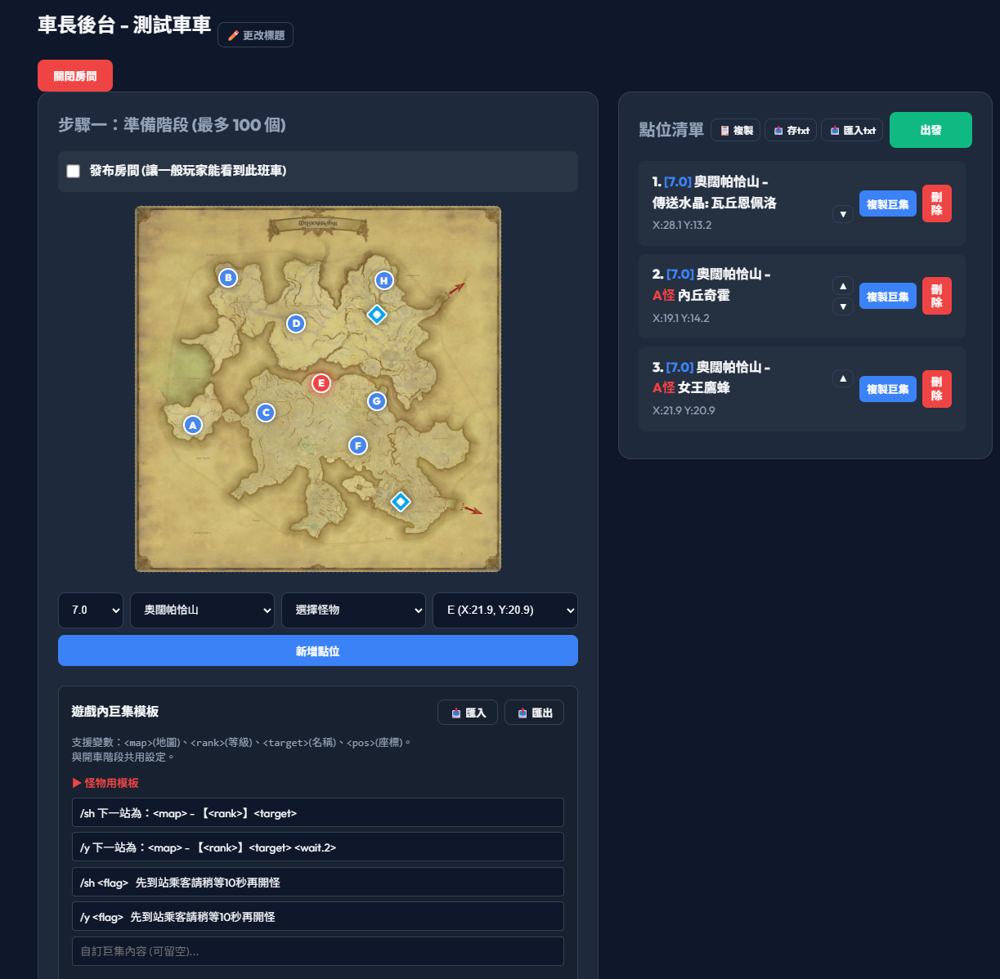
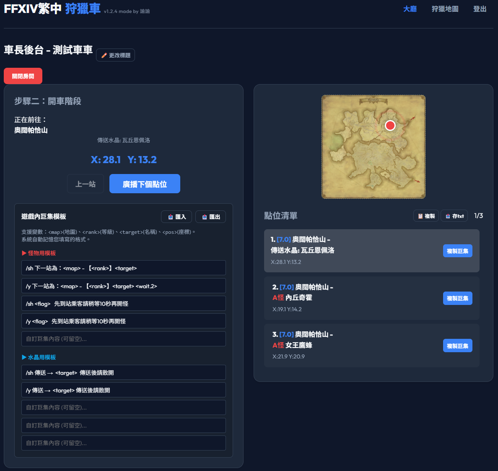

# FFXIV Hunting Train Dashboard (FFXIV繁中狩獵車)

為了車長設計的狩獵車網站 支援列車gps功能

## 功能特色

### 車長後台
- **Discord 一鍵登入**：登入後即可進行車長操作

- **準備階段(找點階段)**：
  - 支援跨版本 (6.0 - 7.0) 怪物與地圖資料庫。
  - 即時地圖預覽，座標點選自動帶入。
  - 清單卡片管理，可隨時刪除調整點位順序。
  - 點位輸出匯入功能，便利多人協作發車。
  - 巨集管理系統，巨集模板一鍵複製

- **開車階段**：
  - 除了準備階段功能外，多了列車GPS(點位廣播)，訪客可以看到當前站點

### 乘客視角 (免登入)
- **實時點位更新**：
  - 車長一旦點擊下一站，GPS系統廣播至所有乘客頁面，畫面同步更新！

### 狩獵地圖
- **6.0 - 7.0**：狩獵地圖 A怪S怪快速查詢可能點位!

## 技術架構
- **前端語言**：純 HTML5, CSS3, JavaScript (Vanilla JS)。不依賴厚重的框架，輕量且載入極快。
- **後端服務**：[Supabase](https://supabase.com/) (BaaS)
  - `PostgreSQL` 資料庫 (存放列車狀態與房間列表)
  - `Supabase Auth` (Discord OAuth 驗證)
  - `Supabase Realtime` (廣播列車當前狀態變更給所有乘客)
